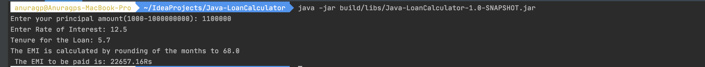

# Simple Java Application To Calculate EMI

You can Run the program by following the given steps: <br />

```
1. Do A Gradle Build using the gradle wrapper 

./grdlew clean build

2. This would create a jar in the following directory `buid/app`. You can Run the jar using the following command.

java -jar build/libs/Java-LoanCalculator-1.0-SNAPSHOT.jar

```


