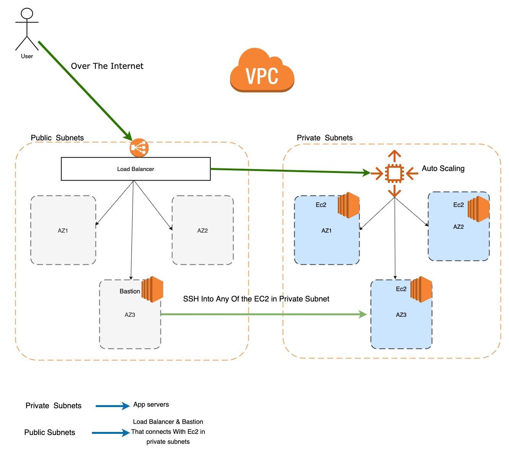

## This project creates the following aws resources

### Network Module
    - VPC
    - Subnets 
    - Routetable
    - Internet-Gateway
    - NAT-Gateway
    - Routes
    - Route Table Association
    - Security Groups
   
### Public Ec2 Instances Module
    
    - Launch Configuration
    - Autoscaling Group
    - EC2
    - EBS
    - Key Pair
    
### Private Ec2 Instances Module
    - Launch Template
    - Autoscaling Group
    - Ec2
    - EBS
    - key Pair
    


#### Quick Start
```
terraform init
terraform plan -var-file=environments/stage.tfvars
terraform apply -target=module.vpc -var-file=environments/stage.tfvars 
terraform apply -var-file=environments/stage.tfvars
```

I have gone with simple installation of nginx to demo. once you run the above commands it would create:

1. Instances in private subnet using Auto scaling group 
2. Install nginx in the instances (customise install_nginx.sh to install actual application)
3. Create a load balancer in public subnet and attach the instance to it.
4. create a instance (bastion node) in public subnet from where you can ssh into nodes in private subnet


#### vpc module

This would create all our networking resources like vpc,subnets,internetgateway and NAT gateway.
This would create subnets in all the distinctly available zones before using the same AZ again.
```
terraform apply -target=module.vpc -var-file=environment/stage.tfvars
```

#### private_ec2_instances module

This module requires `loadbalancer` module so before executing this modules we need to apply `loadbalancer` module.

```
terraform apply -target=module.loadbalancer -target=module.private_ec2 -var-file=environment/stage.tfvars

```
 This creates the following resources:
 
 1. Launch template and Auto Scaling Group 
 2. one instance in private subnet with nginx installed form the `install_nginx.sh` script
 3. A key pair. You can find the public and private key with the name private_ec2_key_pair.
 4. Loadbalancer with the ec2 attached to it.
 
 ``
 terraform output load_balancer_dns --> gives the DNS name of the ELB 
``
Upon hitting the URL in the browser you should see a `Hello World`.

#### public_ec2_instances module


```
terraform apply  -target=module.public_ec2 -var-file=environment/stage.tfvars

```
 This creates the following resources:
 
 1. Launch configuration and Auto Scaling Group 
 2. one instance in public subnet.
 3. A key pair. You can find the public and private key with the name public_ec2_key_pair.
 
 
 ##### Note : All the modules are dependent on vpc module. 
 


